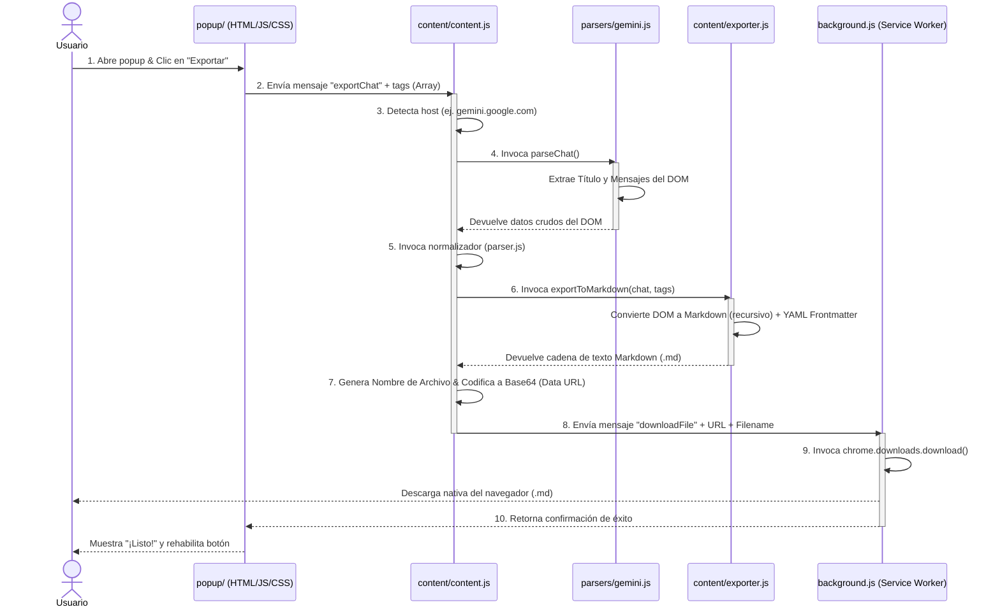

# Flujo Detallado de Exportación — IAChatExporter

Este documento explica paso a paso el proceso que sigue la extensión desde el momento en que se activa en el navegador del usuario hasta que se genera y descarga el archivo Markdown (`.md`) localmente.

---

## Diagrama del Flujo de Comunicación

El flujo de trabajo involucra tres contextos de ejecución aislados dentro de la extensión (Popup, Content Scripts en la pestaña activa y el Background Service Worker):

---

## Explicación Detallada Paso a Paso

### Paso 1: Activación y Detección de la Plataforma
- **Archivo involucrado:** [popup/popup.js](file:///d:/Desarrollo/RepoGit/github/IAChatExporter-extension/popup/popup.js)
- **Acción:** Al abrir el popup haciendo clic en el icono de la extensión, se dispara `DOMContentLoaded` en `popup.js`. Este script realiza una consulta activa utilizando `chrome.tabs.query` sobre la pestaña actualmente activa del navegador.
- **Lógica interna:**
  - Extrae el host del URL (ej. `gemini.google.com`).
  - Si el host coincide con alguna plataforma soportada, el dot de estado de la interfaz se colorea de verde (`status-dot active`), se indica el nombre amigable (ej. "Gemini Detectado") y se habilita el botón principal de exportación.
  - Si el usuario no está en un chat soportado, el botón se bloquea para evitar inyecciones inválidas.

### Paso 2: Envío de la Orden de Exportación
- **Archivos involucrados:** [popup/popup.html](file:///d:/Desarrollo/RepoGit/github/IAChatExporter-extension/popup/popup.html) y [popup/popup.js](file:///d:/Desarrollo/RepoGit/github/IAChatExporter-extension/popup/popup.js)
- **Acción:** El usuario introduce etiquetas opcionales en el campo de texto (separadas por comas) y presiona el botón "Exportar a Markdown".
- **Lógica interna:**
  - `popup.js` captura el evento `click` del botón.
  - Deshabilita el botón y cambia el texto de forma temporal a "Exportando..." para dar retroalimentación visual al usuario.
  - Lee el valor del campo de texto de etiquetas, las separa por comas usando `.split(',')`, limpia espacios en blanco externos usando `.map(t => t.trim())` y filtra strings vacíos.
  - Utiliza `chrome.tabs.sendMessage` para enviar el objeto `{ action: 'exportChat', tags: tagsArray }` de forma directa a la pestaña de chat activa.

### Paso 3: Recepción e Identificación de Plataforma en la Pestaña
- **Archivo involucrado:** [content/content.js](file:///d:/Desarrollo/RepoGit/github/IAChatExporter-extension/content/content.js)
- **Acción:** El script inyectado de contenido en la pestaña del chat recibe el mensaje enviado por el popup mediante el listener `chrome.runtime.onMessage.addListener`.
- **Lógica interna:**
  - `content.js` consulta `window.location.hostname`.
  - Determina qué parser global debe utilizar: `window.IAChatExporterGeminiParser` para Gemini, `window.IAChatExporterClaudeParser` para Claude, o `window.IAChatExporterChatGPTParser` para ChatGPT.

### Paso 4: Extracción de Datos Crudos del DOM
- **Archivo involucrado:** [parsers/gemini.js](file:///d:/Desarrollo/RepoGit/github/IAChatExporter-extension/parsers/gemini.js) (o homólogos)
- **Acción:** Se invoca la función `parseChat()` del parser correspondiente.
- **Lógica interna (Caso Gemini):**
  - **Título:** Busca secuencialmente en elementos del panel lateral o del topbar que correspondan a la conversación seleccionada (`conversation-title`). Si no existen, extrae el título de la pestaña actual (`document.title`) eliminando el prefijo `"Gemini - "`.
  - **Mensajes:** Hace una selección en el DOM buscando las etiquetas personalizadas de la aplicación de Google: `<user-query>` y `<model-response>`. 
  - Recorre en bucle todos los elementos coincidentes en orden de aparición (garantizando el orden cronológico original).
  - Para cada `<user-query>` (usuario), extrae el nodo que contiene el texto de la consulta (`.query-text`), aislando los botones de edición de la interfaz.
  - Para cada `<model-response>` (asistente), extrae el nodo con clase `.message-content` para descartar los botones de "compartir", "me gusta" y fuentes externas.
  - Retorna un objeto `{ title, messages: Array<{ author: 'user'|'ai', element: HTMLElement }> }`.

### Paso 5: Normalización de Datos
- **Archivo involucrado:** [content/parser.js](file:///d:/Desarrollo/RepoGit/github/IAChatExporter-extension/content/parser.js)
- **Acción:** `content.js` toma los datos crudos del DOM y los pasa a la función `window.IAChatExporterParser.normalizeChat()`.
- **Lógica interna:**
  - Extrae la fecha actual del sistema en formato `YYYY-MM-DD`.
  - Depura y limpia los textos de los títulos.
  - Normaliza la clave del autor a un estándar restringido (`'user'` o `'ai'`).
  - Conserva los nodos HTML de los mensajes para que el exportador los renderice apropiadamente.

### Paso 6: Transformación HTML a Markdown
- **Archivo involucrado:** [content/exporter.js](file:///d:/Desarrollo/RepoGit/github/IAChatExporter-extension/content/exporter.js)
- **Acción:** Se invoca `window.IAChatExporterExporter.exportToMarkdown(chatData, tags)`.
- **Lógica interna:**
  - **Frontmatter YAML:** Construye el encabezado delimitado por `---` que contiene el título del chat, la fecha de exportación, la plataforma origen de la IA y el arreglo formateado de etiquetas `["tag1", "tag2"]`.
  - **Conversión de Mensajes:** Para cada mensaje en el chat, utiliza la función interna recursiva `convertNodeToMarkdown(node)`.
    - Esta función analiza de forma recursiva el árbol DOM del mensaje para traducir etiquetas HTML a Markdown plano sin librerías externas.
    - Convierte párrafos (`
`), negritas (`<strong>`/`<b>`), cursivas (`<em>`/`<i>`), saltos de línea (` `), bloques de código estructurados (`<pre><code>`), código inline (`<code>`), citas (`<blockquote>`), hipervínculos (`<a>`), listas (`<ul>`/`<ol>` y `<li>`) y tablas (`<table>`, `<tr>`, `<td>`, `<th>`).
  - **Firma:** Añade un pie de página indicando que fue exportado con la extensión incluyendo la hora y fecha locales actuales.

### Paso 7: Preparación de la Descarga en la Pestaña
- **Archivo involucrado:** [content/content.js](file:///d:/Desarrollo/RepoGit/github/IAChatExporter-extension/content/content.js)
- **Acción:** Al recibir el texto completo en Markdown, el orquestador prepara el flujo de guardado.
- **Lógica interna:**
  - Utiliza la función local `slugify(title)` para convertir el título en una cadena compatible con nombres de archivo en minúsculas separadas por guiones (ej. `IAChatExporter-gemini-creacion-de-plugin-2026-05-28.md`).
  - Convierte el texto Markdown a codificación Base64 en un string URI de datos (`data:text/markdown;charset=utf-8;base64,...`). Esto es sumamente importante para evitar que caracteres del idioma español como tildes (`á`, `é`), eñes (`ñ`) o emojis se corrompan o no se lean adecuadamente en la descarga.

### Paso 8: Descarga Local Física
- **Archivo involucrado:** [background.js](file:///d:/Desarrollo/RepoGit/github/IAChatExporter-extension/background.js)
- **Acción:** `content.js` envía el mensaje `{ action: 'downloadFile', url: dataUrl, filename: filename }` al Service Worker de segundo plano.
- **Lógica interna:**
  - El Service Worker recibe la petición y llama a la API `chrome.downloads.download`.
  - Se activa el selector de guardado del navegador del usuario (`saveAs: true`), permitiéndole renombrar o elegir la carpeta destino en su sistema de archivos local de forma nativa.
  - La descarga física es gestionada de manera segura fuera de las restricciones CSP del chat de la IA.
  - Se devuelve un callback de confirmación a `content.js` y posteriormente a `popup.js`, el cual cambia su interfaz mostrando "¡Listo!" y habilitando el botón nuevamente.
